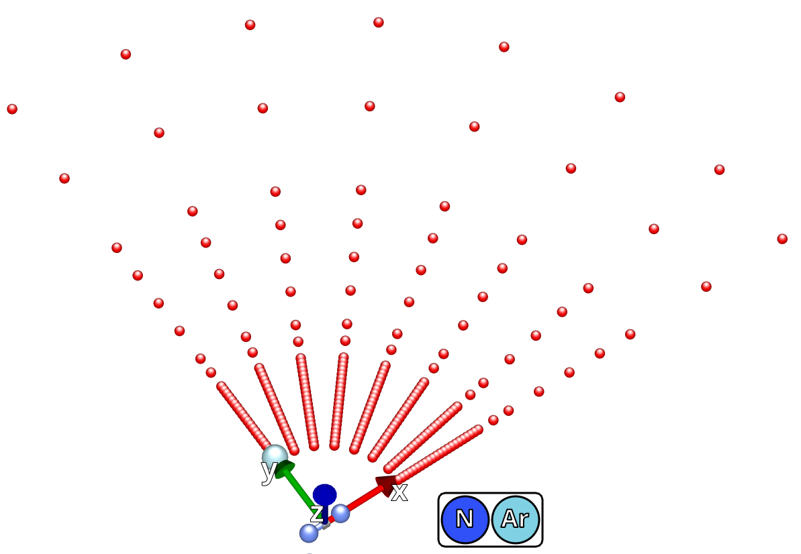
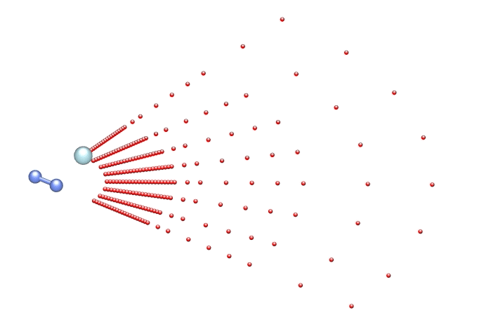

### Notes about computed N$_2$-Ar PES

#### BSSE And Interaction Energy

Interaction energy:

$E_{AB}^{int} = E_{AB}-E_A-E_B$

Boys-Bernardi counterpoise correction:  


#### Files
1) ccsdt_cbs_augcc_45_a.pes - 2 point CBS(4,5) + BSSE
2) ccsdt_augcc_tzp_a.pes
3) ccsdt_augcc_qzp_a.pes
4) ccsdt_augcc_5zp_a.pes
2) ccsdt_augcc_3pcbs_a.pes


#### Mesh settings

```javascript
Radial(Angstrom) = {
    2.5136 2.6459 2.7782 2.9105 3.0428 3.1751
    3.3074 3.4397 3.5719 3.7042 3.8365 3.9688 
    4.1011 4.2334 4.3657 4.4980 4.6303 4.7626 
    4.8949 5.0272 5.1595 5.2918 5.8209 6.3501 
    7.4085 8.4668 9.5252 10.5835 13.2294 15.8753
}

Angular(Degrees) = {
    90.000000000000 76.675943783746 63.352978527405 
    50.032772265883 36.718935738978 23.422528263644
    10.204060805305 0.000000000000
}
```

#### Mesh representation

Red points represents position of Ar:
<p align="center">

</p>

Evolution of Ar position through mesh:
<p align="center">

</p>

#### CBS

##### 2 Point:

##### 3 Point:

